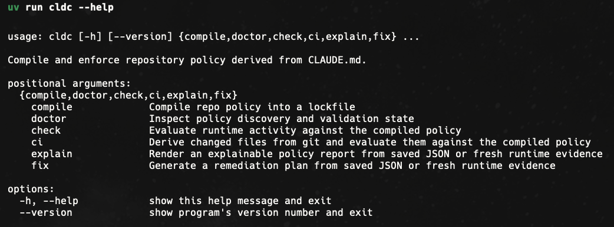

<div align="center">

# claude-md-compiler

**Compile `CLAUDE.md` into a versioned policy lockfile and enforce it against file edits, commands, and git diffs.**

[](https://pypi.org/project/claude-md-compiler/)
[](https://pypi.org/project/claude-md-compiler/)
[](./LICENSE)
[](https://github.com/astral-sh/uv)
[](https://docs.pytest.org/)
[](https://github.com/AbdelStark/claude-md-compiler)



</div>

## What it does

`cldc` is a Python CLI **and** a typed library that compiles repository policy
from `CLAUDE.md`, `.claude-compiler.yaml`, and `policies/*.yml` into a
versioned lockfile, then checks file edits, commands, and git diffs against
that policy. It is purpose-built for agentic coding harnesses (Claude Code,
Cursor, Aider, etc.) that need a deterministic, offline, exit-coded judge
sitting between the model and the working tree.

## In plain English

When you use an agentic coding tool (Claude Code, Cursor, Aider, etc.), the agent reads `CLAUDE.md` for "house rules": which folders are off-limits, which docs to consult before editing, which commands must run before a change is considered done. That file is **prose**. The agent decides, on each turn, whether to honor it. There is no enforcement, no audit trail, and no way for CI to check the same rules later.

`cldc` closes that gap with three ideas borrowed from compiler and policy engineering.

### 1. Compile prose into a contract

A compiler turns ambiguous source (human text, high-level code) into a precise artifact (machine code, IR). `cldc` does the same to your agent rules: it reads `CLAUDE.md`, fenced ` ```cldc ` blocks, `.claude-compiler.yaml`, and `policies/*.yml`, validates them against a strict schema, and writes `.claude/policy.lock.json` — a deterministic, sorted, versioned lockfile. From that moment, "the policy" is a hash, not a paragraph. Two machines compiling the same sources produce byte-identical lockfiles. Drift becomes detectable.

### 2. Separate policy, evidence, and decision

Most "AI guardrail" tools tangle these three things together. `cldc` keeps them apart on purpose:

- **Policy** is the set of rules in the lockfile (`deny_write`, `require_read`, `require_command`, `couple_change`, `require_claim`).
- **Evidence** is what actually happened on a given run: files read, files written, commands executed, claims asserted. You hand it to `cldc` via flags, a JSON file, stdin, or a git diff.
- **Decision** is the pure function `evaluate(policy, evidence) -> {pass, warn, block}` plus a structured report. No hidden state, no network calls, no LLM in the loop.

This split is the whole point. The agent (or a human, or CI) produces evidence; `cldc` is the judge. The judge never guesses; if required evidence is missing, the rule fails closed.

### 3. The harness, not the model, enforces the rules

In agentic systems, the **harness** is the wrapper around the model: the loop that decides which tool calls to allow, which files to expose, when to stop. Asking the model to police itself is unreliable — the same machinery that hallucinates code can hallucinate compliance. Reliable agentic systems push enforcement *out* of the model and into deterministic code that runs around every tool call or before every commit. `cldc` is built to be that piece. `cldc check` is fast, offline, exit-coded (`0`/`1`/`2`), and JSON-structured precisely so a harness, a pre-commit hook, or a CI step can call it and act on the result without parsing English.

### What this looks like end-to-end

```
CLAUDE.md             ─┐
.claude-compiler.yaml ─┼─►  cldc compile  ─►  .claude/policy.lock.json
policies/*.yml        ─┘                                │
                                                        ▼
agent run / git diff / pre-commit ─►  evidence  ─►  cldc check  ─►  pass | warn | block  + JSON report
                                                                                │
                                                                                ▼
                                                                            cldc fix  ─►  remediation plan
```

You compile once per change to the policy sources. You check on every meaningful action. You `explain` when a result needs a human-readable rendering. You ask `fix` for a plan when you want guidance instead of just a verdict.

### Why a lockfile, specifically

A lockfile is the smallest unit of trust that survives time and travel:

- **Reproducible**: byte-identical from the same inputs, with sorted keys and explicit schema/version fields.
- **Reviewable**: it diffs cleanly in a PR — policy changes are visible, not buried in a cache.
- **Refusable**: `cldc check` rejects a stale or schema-drifted lockfile instead of silently re-deriving one. If your `CLAUDE.md` moved and the lockfile didn't, the next check fails until you recompile. That refusal *is* the feature.

### What `cldc` deliberately does *not* do

- It does not call any LLM. There is no model in the runtime path.
- It does not auto-edit your repo. `fix` produces a plan; humans or the agent execute it.
- It does not invent rule kinds. Unsupported rules are a hard error, never a silent pass.
- It does not phone home. Every check is local, offline, and deterministic.

## Why it exists

`CLAUDE.md` is usually advisory text. `cldc` turns repo rules into a
deterministic artifact that local runs, CI, and review tooling can enforce the
same way every time.

## Who it is for

- Developers using agentic coding tools in real repositories.
- Platform or infra teams that want repo-level guardrails.
- Maintainers who want explainable, local-first policy checks instead of hidden heuristics.

## Table of contents

- [What it does](#what-it-does)
- [In plain English](#in-plain-english)
- [Why it exists](#why-it-exists)
- [Who it is for](#who-it-is-for)
- [Install](#install)
- [60-second tour](#60-second-tour)
- [Command surface](#command-surface)
- [Interactive TUI](#interactive-tui)
- [Automatic enforcement hooks](#automatic-enforcement-hooks)
- [Exit codes and JSON contracts](#exit-codes-and-json-contracts)
- [End-to-end test against a real repo](#end-to-end-test-against-a-real-repo)
- [How policy is authored](#how-policy-is-authored)
- [Preset policy packs](#preset-policy-packs)
- [Rule model](#rule-model)
- [Evidence inputs](#evidence-inputs)
- [Library API](#library-api)
- [Architecture](#architecture)
- [Development](#development)
- [Project status](#project-status)
- [Learn more](#learn-more)
- [License](#license)

## Install

`cldc` requires Python 3.11+. The recommended path is a tool-style install
through `uv` or `pipx`, which keeps the CLI on its own venv:

```bash
# persistent install (recommended)
uv tool install claude-md-compiler

# or
pipx install claude-md-compiler

# one-shot, no install
uvx --from claude-md-compiler cldc --version
```

For local development inside this repository, use the
[development workflow](#development) instead of installing the project into
itself.

## 60-second tour

Bootstrap a brand-new repo, compile policy, and enforce it on the very next
file edit:

```bash
# 1. Scaffold .claude-compiler.yaml + a stub CLAUDE.md
cldc init . --preset default --preset strict

# 2. Compile policy into .claude/policy.lock.json
cldc compile .

# 3. Check a hypothetical change directly
cldc check . --write src/main.py --command "pytest -q"

# 4. Render a human-readable report
cldc explain . --write src/main.py --format markdown

# 5. Build a deterministic remediation plan
cldc fix . --write src/main.py --format markdown

# 6. Gate a staged diff or PR range from CI
cldc ci . --staged
cldc ci . --base origin/main --head HEAD

# 7. Explore everything interactively in the terminal
cldc tui .

# 8. Wire enforcement into git and Claude Code automatically
cldc hook install git-pre-commit .
cldc hook generate claude-code > .claude/settings.json
```

## Command surface

| Command | What it does |
| --- | --- |
| `cldc init` | Scaffold `.claude-compiler.yaml` (and a stub `CLAUDE.md`) for a fresh repo, extending one or more bundled presets. |
| `cldc compile` | Compile sources into a deterministic `.claude/policy.lock.json` lockfile. |
| `cldc doctor` | Inspect discovery, parsing, and lockfile health; surface stale/drifted artifacts. |
| `cldc check` | Evaluate runtime evidence (reads, writes, commands, claims) against the lockfile. |
| `cldc ci` | Derive write paths from `git diff --cached` or `git diff base...head` and run `check`. |
| `cldc explain` | Render a saved report (or fresh evidence) as text or Markdown. |
| `cldc fix` | Build a deterministic remediation plan from a saved report or fresh evidence. |
| `cldc preset list` / `show` | Browse the bundled preset policy packs. |
| `cldc hook generate` / `install` | Emit or install a git pre-commit hook or a Claude Code settings snippet. |
| `cldc tui` | Launch the interactive Textual-based policy explorer. |

## Interactive TUI

`cldc tui` launches a Textual-powered terminal UI for exploring a repo's policy
without leaving the shell. It shows the discovered sources, the rule table with
live mode badges, the selected rule's full definition, a four-field evidence
form (reads / writes / commands / claims), and a colored decision panel that
updates on every check.

Keybindings:

| Key     | Action |
| ------- | --- |
| `c`     | Compile the repo (`cldc compile`) |
| `r`     | Run a check against the current evidence |
| `d`     | Open the doctor report |
| `p`     | Browse bundled preset packs |
| `R`     | Reload sources from disk |
| `ctrl+l` | Clear the evidence form |
| `?`     | Show help |
| `q`     | Quit |

The TUI uses only the same library calls as the non-interactive CLI, so the
behavior you see on screen is the behavior a `cldc check` in CI would produce.

## Automatic enforcement hooks

`cldc hook` generates and installs hook scripts that run policy
enforcement at the moments work is finished, so you do not have to
remember to invoke `cldc check` or `cldc ci` by hand.

```bash
# Print a portable POSIX git pre-commit script that runs `cldc ci --staged`
cldc hook generate git-pre-commit

# Install it directly into .git/hooks/pre-commit and mark it executable
cldc hook install git-pre-commit .

# Refuse to clobber an existing hook unless --force is passed
cldc hook install git-pre-commit . --force

# Print a .claude/settings.json snippet that wires `cldc check` into the
# Claude Code agent harness as a PostToolUse hook on Edit|Write|MultiEdit
cldc hook generate claude-code
cldc hook generate claude-code --json
```

The git pre-commit script is self-contained and skips gracefully (with
a warning) if `cldc` is not on `PATH`, so checking out the hook on a
machine without `cldc` installed will not break commits. Use
`git commit --no-verify` to bypass it for a single commit.

The Claude Code snippet is generate-only by design — it is meant to be
copied or merged into an existing `.claude/settings.json` rather than
written blindly over a settings file the user may already have customized.

## Exit codes and JSON contracts

`cldc` is built to be called from a harness, a CI step, or a pre-commit hook,
not just from a human shell. Every command behaves predictably in those
contexts:

| Exit code | Meaning |
| --- | --- |
| `0` | Clean run, or a non-blocking result (decisions `pass` or `warn`). |
| `1` | Runtime or input error (malformed repo, bad evidence payload, git failure, stale lockfile, etc.). |
| `2` | Blocking policy violations (decisions `block`). |

Every command supports `--json` for machine-readable output and `--output
<file>` to persist that output to disk (parent directories are created on
demand). When a command fails (exit `1`), the `--json` error payload carries:

```json
{
  "command": "check",
  "ok": false,
  "error": "compiled lockfile not found at .claude/policy.lock.json; run `cldc compile` before `cldc check`",
  "error_type": "FileNotFoundError"
}
```

`error_type` is the Python exception class name (e.g. `LockfileError`,
`GitError`, `EvidenceError`, `RepoBoundaryError`, `FileNotFoundError`) so
downstream tooling can route on the failure mode without regex-parsing the
message.

Three JSON artifacts are versioned contracts and carry both `$schema` and a
string `format_version`:

| Artifact | `$schema` | `format_version` |
| --- | --- | --- |
| Policy lockfile | `https://cldc.dev/schemas/policy-lock/v1` | `1` |
| Check report | `https://cldc.dev/schemas/policy-report/v1` | `1` |
| Fix plan | `https://cldc.dev/schemas/policy-fix-plan/v1` | `1` |

Mismatched versions are rejected outright instead of being interpreted on a
best-effort basis. Re-run `cldc compile` after upgrading the package.

Global flags on the top-level `cldc` command:

- `--verbose`, `-v`: emit debug-level diagnostics to stderr and print the full
  traceback on errors. Use this when filing bugs.
- `--quiet`, `-q`: suppress warnings, leaving only errors.
- `--version`: print the package version.

## End-to-end test against a real repo

The repo ships an opt-in e2e test suite that demonstrates the full
compile → check → fix flow against a real upstream repo. By default it
clones [langchain-ai/langchain](https://github.com/langchain-ai/langchain),
drops a hand-authored `.claude-compiler.yaml` (under
`tests/e2e/compiler.yaml`) that translates langchain's CLAUDE.md prose
into enforceable rules, and walks through:

- a **red phase**: edits that should violate specific rules and the
  decision is `block` with a non-zero exit code,
- a **green phase**: a complete evidence set that satisfies every rule
  and the decision is `pass`,
- a **fix-plan phase**: building a remediation plan from the red report
  and asserting the steps reference the right rules.

Run it with:

```bash
make e2e
# or
uv run pytest -m e2e -v
```

The suite is excluded from the default `pytest` run via the `e2e` marker, so
it never slows down regular CI. It requires `git` on `PATH` and network
access; both are checked at collection time and produce a clean `pytest.skip`
if missing.

## How policy is authored

Sources are discovered from the repo root or any nested path inside the repo. Merge order is deterministic:

1. `CLAUDE.md`
2. inline fenced ```` ```cldc ```` blocks inside `CLAUDE.md`
3. `.claude-compiler.yaml` or `.claude-compiler.yml`
4. bundled presets referenced from `.claude-compiler.yaml` via `extends:`
5. `policies/*.yml` and `policies/*.yaml`

Example:

````markdown
# CLAUDE.md

```cldc
rules:
  - id: generated-lock
    kind: deny_write
    mode: block
    paths: ["generated/**"]
    message: Generated files must not be edited by hand.
```
````

```yaml
# .claude-compiler.yaml
default_mode: warn
extends:
  - default        # bundled preset: generated/** is read-only, lockfile-follows-manifest
  - strict         # bundled preset: tests-follow-source, arch-read, ci-green claim
rules:
  - id: keep-tests-in-sync
    kind: couple_change
    paths: ["src/**"]
    when_paths: ["tests/**"]
    message: Update tests when source changes.
```

## Preset policy packs

`cldc` ships with opinionated rule packs you can merge into your repo policy via `extends:` in `.claude-compiler.yaml`.

| Preset | What it does |
| --- | --- |
| `default` | Blocks writes to `generated/**`, `dist/**`, `build/**`; warns when a dependency manifest changes without a matching `install`/`sync`/`tidy` command. |
| `strict` | Requires tests to move with source, requires an architecture/RFC read before editing `src/**`, and requires a `ci-green` claim to ship `src/**` changes. |
| `docs-sync` | Couples public CLI / runtime / API changes with README/docs updates, and couples version bumps with changelog entries. |

Inspect the bundled packs:

```bash
cldc preset list
cldc preset show default
cldc preset show strict --json
```

Use them by listing one or more names under `extends:`:

```yaml
# .claude-compiler.yaml
extends:
  - default
  - docs-sync
```

Preset rules merge alongside your own rules. Duplicate rule IDs fail the compile, so pick unique IDs for your own rules.

## Rule model

| Kind | Required fields | Meaning |
| --- | --- | --- |
| `deny_write` | `paths` | Paths matching `paths` must not be written. |
| `require_read` | `paths`, `before_paths` | Writing `paths` requires a prior read matching `before_paths`. |
| `require_command` | `commands`, `when_paths` | Writing `when_paths` requires at least one listed command to run. |
| `forbid_command` | `commands` (optional `when_paths`) | The listed commands must not run; scoped to `when_paths` when provided, otherwise repo-wide. |
| `couple_change` | `paths`, `when_paths` | Writing `paths` requires a companion write matching `when_paths`. |
| `require_claim` | `claims`, `when_paths` | Writing `when_paths` requires at least one listed claim to be asserted. |

Example `require_claim` rule — block edits to `src/**` until a reviewer asserts `qa-reviewed`:

```yaml
rules:
  - id: qa-sign-off
    kind: require_claim
    mode: block
    when_paths: ["src/**"]
    claims: ["qa-reviewed", "security-reviewed"]
    message: QA or security must sign off before editing source.
```

| Mode | Meaning |
| --- | --- |
| `observe` | Record the result but do not block. |
| `warn` | Report the result but do not block. |
| `block` | Report the result and exit `2`. |
| `fix` | Report the result as blocking and include remediation guidance. |

## Evidence inputs

Runtime commands accept evidence three ways:

```bash
# direct flags
cldc check . --read docs/spec.md --write src/main.py --command "pytest -q" --claim qa-reviewed

# JSON file
cldc check . --events-file .cldc-events.json --json

# stdin JSON
cat .cldc-events.json | cldc check . --stdin-json --json
```

Use `--claim` once per asserted claim; claims satisfy `require_claim` rules in the compiled policy.

Accepted payload shape:

```json
{
  "read_paths": ["docs/spec.md"],
  "write_paths": ["src/main.py"],
  "commands": ["pytest -q"],
  "claims": ["qa-reviewed"],
  "events": [
    {"kind": "read", "path": "docs/spec.md"},
    {"kind": "write", "path": "src/main.py"},
    {"kind": "command", "command": "pytest -q"},
    {"kind": "claim", "claim": "qa-reviewed"}
  ]
}
```

Saved report workflow:

```bash
cldc check . --write src/main.py --json --output artifacts/policy-report.json
cldc explain . --report-file artifacts/policy-report.json --format markdown --output artifacts/policy-report.md
cldc fix . --report-file artifacts/policy-report.json --json --output artifacts/policy-fix-plan.json
```

## Library API

`cldc` is a typed Python library as well as a CLI. The package ships a
`py.typed` marker so downstream type checkers pick up the inline annotations,
and every public type lives under a stable import path:

```python
from cldc import __version__
from cldc.compiler.policy_compiler import compile_repo_policy, doctor_repo_policy
from cldc.runtime.evaluator import check_repo_policy, CheckReport, Violation
from cldc.runtime.events import load_execution_inputs, ExecutionInputs
from cldc.runtime.git import collect_git_write_paths
from cldc.runtime.remediation import build_fix_plan, render_fix_plan
from cldc.runtime.reporting import load_check_report, render_check_report
from cldc.runtime.hooks import generate_hook, install_hook
from cldc.scaffold import initialize_repo_policy
from cldc.errors import (
    CldcError,           # base class, inherits from ValueError
    LockfileError,
    EvidenceError,
    ReportError,
    PolicySourceError,
    PresetError,
    PresetNotFoundError,
    RuleValidationError,
    RepoBoundaryError,
    GitError,
)
```

A minimal end-to-end run from a Python script:

```python
from pathlib import Path

from cldc.compiler.policy_compiler import compile_repo_policy
from cldc.runtime.evaluator import check_repo_policy

repo = Path(".")
compile_repo_policy(repo)

report = check_repo_policy(
    repo,
    write_paths=["src/main.py"],
    commands=["pytest -q"],
    claims=["ci-green"],
)

if report.decision == "block":
    for violation in report.violations:
        print(f"[{violation.mode}] {violation.rule_id}: {violation.message}")
    raise SystemExit(2)
```

See [`docs/library-usage.md`](./docs/library-usage.md) for the full library
reference, including every public dataclass, the JSON shapes that
`to_dict()` produces, and worked examples for each rule kind.

## Architecture

`cldc` has a pure-core / thin-shell shape:

- `src/cldc/ingest/` — discover the repo root and load canonical policy sources.
- `src/cldc/parser/` — validate and normalize rule documents.
- `src/cldc/compiler/` — build `.claude/policy.lock.json` and doctor the repo state.
- `src/cldc/runtime/` — evaluate evidence, render reports, build fix plans, and integrate with git.
- `src/cldc/presets/` — bundled opinionated policy packs and the loader API.
- `src/cldc/scaffold.py` — `cldc init` onboarding scaffolder.
- `src/cldc/cli/` — thin argparse shell that exposes the commands and exit codes.
- `src/cldc/tui/` — Textual-based interactive policy explorer.

See [ARCHITECTURE.md](./ARCHITECTURE.md) for the full data flow, invariants,
schema contracts, and extension points.

## Development

```bash
git clone https://github.com/AbdelStark/claude-md-compiler
cd claude-md-compiler
uv sync --locked

# Run the full local quality gate (lint + format-check + types + tests + build + smoke)
make all

# Or step by step
uv run pytest -q
uv run ruff check src tests
uv run ruff format --check src tests
uv run pyright src
uv build
```

Useful local commands:

```bash
uv run cldc --help
uv run cldc compile tests/fixtures/repo_a
uv run cldc check tests/fixtures/repo_a --write src/main.py --json
uv run cldc ci tests/fixtures/repo_a --base HEAD --head HEAD --json
uv run cldc explain tests/fixtures/repo_a --write src/main.py --format markdown
uv run cldc fix tests/fixtures/repo_a --write src/main.py --json
uv run cldc tui tests/fixtures/repo_a
```

The repository does not require runtime environment variables. See
[`CONTRIBUTING.md`](./CONTRIBUTING.md) for the full contributor workflow.

## Project status

`cldc` is published on PyPI as
[`claude-md-compiler`](https://pypi.org/project/claude-md-compiler/) and is
currently in alpha. The contracts that downstream tooling cares about — the
lockfile, the check report, and the fix plan — are versioned with `$schema`
and `format_version` fields, and a major-version bump is required to break
their shape. The CLI surface (`init`, `compile`, `doctor`, `check`, `ci`,
`explain`, `fix`, `preset`, `hook`, `tui`) is stable and covered by 260+
tests including Hypothesis property tests, an opt-in end-to-end suite that
runs against a real upstream repository (`langchain-ai/langchain`), and a
post-build smoke test against the freshly built wheel. The library reaches
**92 % combined branch + statement coverage** under `pytest --cov`.

## Learn more

- [ARCHITECTURE.md](./ARCHITECTURE.md) — layered design, data flow, schema contracts, and extension points
- [docs/library-usage.md](./docs/library-usage.md) — library reference and worked examples
- [docs/rfcs/](./docs/rfcs/) — frozen specification documents for the JSON contracts
- [CONTRIBUTING.md](./CONTRIBUTING.md) — contributor workflow and quality gates
- [CHANGELOG.md](./CHANGELOG.md) — release history in Keep a Changelog format
- [SECURITY.md](./SECURITY.md) — supported versions and how to report a vulnerability

## License

[MIT](./LICENSE) © `claude-md-compiler` contributors.
