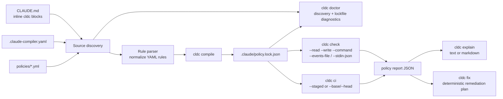

<div align="center">

# claude-md-compiler

Compile `CLAUDE.md` into a lockfile, then enforce repo changes against it in local runs, staged diffs, or CI.


</div>


## How It Works



## 3-Step Quick Start

1. Sync the local toolchain.

   ```bash
   uv sync
   ```

   ```text
   Resolved 8 packages in 2ms
   Audited 7 packages in 0.26ms
   ```

2. Compile the example policy repo into a lockfile.

   ```bash
   uv run cldc compile tests/fixtures/repo_a
   ```

   ```text
   Compiled 3 rules from 4 sources into .claude/policy.lock.json for .../tests/fixtures/repo_a
   Default mode: warn
   Source digest: 6c24d05e4b99ae5a5593d33f00098244d9b07eb791cf2f22c6a9fb43674a7026
   Discovery warnings:
   - compiled lockfile not found at .claude/policy.lock.json
   ```

3. Run a passing policy check with real evidence.

   ```bash
   uv run cldc check tests/fixtures/repo_a \
     --write src/main.py \
     --read docs/rfcs/CLDC-0006-validator-engine.md \
     --command "pytest -q" \
     --json
   ```

   ```text
   {
     "decision": "pass",
     "summary": "Policy check passed with no violations.",
     "violation_count": 0
   }
   ```

## The Good Stuff

### Reuse One Report Everywhere

```bash
uv run cldc check . --events-file .cldc-events.json --json --output artifacts/policy-report.json
uv run cldc explain . --report-file artifacts/policy-report.json --format markdown --output artifacts/policy-explanation.md
uv run cldc fix . --report-file artifacts/policy-report.json --format markdown --output artifacts/policy-fix-plan.md
```

- `--events-file` accepts `read_paths`, `write_paths`, `commands`, `claims`, or an `events` array with `read`, `write`, `command`, and `claim`.
- `--output` writes the exact emitted payload to disk and creates parent directories automatically.
- `explain` and `fix` consume the same saved JSON artifact without rerunning enforcement.

### Gate a Staged Diff

```bash
uv run cldc ci . --staged --json
```

- `ci` maps `git diff --cached --name-only` into policy `write_paths`.
- Use `--base origin/main --head HEAD` for pull request range checks.
- Blocking violations return exit code `2`; warning-only reports stay exit code `0`.

### Catch a Hard Block

```bash
uv run cldc check tests/fixtures/repo_a --write generated/output.json --json
```

- `deny_write` rules can block paths like `generated/**` directly from runtime evidence.
- The JSON report carries a stable `$schema`, `format_version`, `decision`, `summary`, and per-rule provenance.

## Configuration / API

Policy discovery walks up from the path you pass and looks for `CLAUDE.md`, `.claude-compiler.yaml` or `.yml`, `policies/*.yml` or `.yaml`, and `.claude/policy.lock.json`.

| Flag | Default | Description |
| --- | --- | --- |
| `--read <path>` | repeatable | Mark repo paths read before making a change. |
| `--write <path>` | repeatable | Mark repo paths written or otherwise touched. |
| `--command <cmd>` | repeatable | Record validation commands already run. |
| `--events-file <file>` | none | Merge JSON execution evidence from disk. |
| `--stdin-json` | `false` | Merge JSON execution evidence from stdin. |
| `--staged` | `false` | In `ci`, evaluate `git diff --cached --name-only`. |
| `--base <ref>` | none | In `ci`, evaluate a git diff range. |
| `--head <ref>` | `HEAD` | Head ref paired with `--base`. |
| `--report-file <file>` | none | In `explain` or `fix`, reuse a saved report artifact. |
| `--format text\|markdown` | `text` | Human-readable render format for `explain` and `fix`. |
| `--json` | `false` | Emit machine-readable JSON. |
| `--output <path>` | none | Mirror stdout to a file and create parent directories. |

## Deployment / Integration

```yaml
name: policy

on:
  pull_request:

jobs:
  cldc:
    runs-on: ubuntu-latest
    steps:
      - uses: actions/checkout@v4
        with:
          fetch-depth: 0

      - uses: astral-sh/setup-uv@v6

      - run: uv sync
      - run: uv run cldc compile .

      - name: Enforce policy and keep the report
        run: |
          set +e
          uv run cldc ci . --base origin/${{ github.base_ref }} --head ${{ github.sha }} --json --output artifacts/policy-report.json
          status=$?
          uv run cldc explain . --report-file artifacts/policy-report.json --format markdown --output artifacts/policy-explanation.md
          exit $status
```

`cldc ci` is the enforcement edge. `cldc explain` turns the saved JSON into a review artifact before the job exits with the original policy status.
