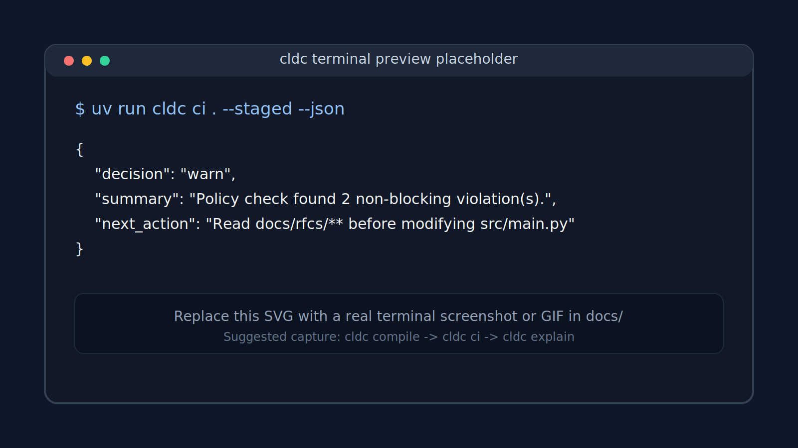

<div align="center">

# claude-md-compiler

**Compile `CLAUDE.md` into a versioned lockfile. Enforce it on local edits, staged diffs, and CI.**

[](https://pypi.org/project/claude-md-compiler/)
[](https://www.python.org/)
[](./LICENSE)

</div>



`cldc` turns the rules in your `CLAUDE.md` into a deterministic policy lockfile, then checks runtime activity (reads, writes, commands, git diffs) against it. The same lockfile gates a local edit, a pre-commit hook, and a pull request.

## Install

```bash
uv add claude-md-compiler        # or: pip install claude-md-compiler
```

Requires Python 3.11+. The only runtime dependency is PyYAML.

## Quick start

```bash
# 1. Compile policy from CLAUDE.md + policies/*.yml
cldc compile .

# 2. Check a change against it
cldc check . --write src/main.py --command "pytest -q"

# 3. Gate a pull request
cldc ci . --base origin/main --head HEAD
```

Exit codes: `0` clean or warn-only · `1` runtime error · `2` blocking violations.

## How it works

```
 sources                                   evidence
 ─────────────────────                     ───────────────────────────
 CLAUDE.md (cldc blocks)                   --read / --write / --command
 .claude-compiler.yaml                     --events-file / --stdin-json
 policies/*.yml                            git diff (staged | base..head)
          │                                            │
          ▼                                            ▼
    cldc compile                               cldc check  /  cldc ci
          │                                            │
          ▼                                            ▼
 .claude/policy.lock.json  ───────────────▶   pass · warn · block
                                                       │
                                           ┌───────────┴───────────┐
                                           ▼                       ▼
                                     cldc explain              cldc fix
                                   (text · md · json)      (remediation plan)
```

Three stages: **discover** sources, **compile** them into a digest-stable lockfile, **enforce** it against execution evidence. Reports are deterministic and reusable — `explain` and `fix` consume saved JSON without re-running enforcement.

## Commands

| Command | Purpose |
| --- | --- |
| `cldc compile [repo]` | Parse sources, write `.claude/policy.lock.json`. |
| `cldc doctor [repo]`  | Diagnose discovery, parsing, and lockfile state. |
| `cldc check [repo]`   | Evaluate runtime evidence against the policy. |
| `cldc ci [repo]`      | Same as `check`, but read changed files from `git diff`. |
| `cldc explain [repo]` | Render a saved or fresh report as text or markdown. |
| `cldc fix [repo]`     | Build a deterministic remediation plan from a report. |

Every command takes `--json` and `--output <file>` for machine-readable, persistable results.

## Writing rules

Rules live inline in `CLAUDE.md`, in `.claude-compiler.yaml`, or in `policies/*.yml`. They merge in that order, deterministically.

````markdown
# CLAUDE.md

```cldc
rules:
  - id: generated-lock
    kind: deny_write
    mode: block
    paths: ["generated/**"]
    message: Generated files are produced by the build — don't edit them.
```
````

```yaml
# policies/commands.yml
rules:
  - id: run-tests
    kind: require_command
    commands: ["pytest -q"]
    when_paths: ["src/**", "tests/**"]
    message: Run tests before finishing.
```

| Kind | What it asserts |
| --- | --- |
| `deny_write`      | A path glob must not be written. |
| `require_read`    | A path must be read before another path is written. |
| `require_command` | A command must run when matching paths are touched. |
| `couple_change`   | Editing one path requires editing another. |

| Mode | Behavior |
| --- | --- |
| `observe` | Recorded only. No exit-code change. |
| `warn`    | Reported, exit `0`. *(default)* |
| `block`   | Reported, exit `2`. |
| `fix`     | Reported with a remediation plan from `cldc fix`. |

## Feeding evidence

`check`, `explain`, and `fix` accept evidence three ways. Mix and match.

```bash
# Direct flags
cldc check . --read docs/spec.md --write src/main.py --command "pytest -q"

# JSON file  (read_paths, write_paths, commands, claims, or events[])
cldc check . --events-file .cldc-events.json

# Stdin
cat .cldc-events.json | cldc check . --stdin-json
```

Save a report once, reuse it everywhere:

```bash
cldc check . --events-file .cldc-events.json --json --output artifacts/report.json
cldc explain . --report-file artifacts/report.json --format markdown --output artifacts/report.md
cldc fix     . --report-file artifacts/report.json --format markdown --output artifacts/fix.md
```

## CI

```yaml
# .github/workflows/policy.yml
name: policy
on: pull_request

jobs:
  cldc:
    runs-on: ubuntu-latest
    steps:
      - uses: actions/checkout@v4
        with: { fetch-depth: 0 }
      - uses: astral-sh/setup-uv@v6
      - run: uv sync
      - run: uv run cldc compile .
      - name: Enforce
        run: |
          set +e
          uv run cldc ci . \
            --base origin/${{ github.base_ref }} --head ${{ github.sha }} \
            --json --output artifacts/policy-report.json
          status=$?
          uv run cldc explain . \
            --report-file artifacts/policy-report.json \
            --format markdown --output artifacts/policy-explanation.md
          exit $status
```

`cldc ci` is the enforcement edge. `cldc explain` turns the saved JSON into a review artifact before the job exits with the original policy status.

## Develop

```bash
git clone https://github.com/AbdelStark/claude-md-compiler
cd claude-md-compiler
uv sync
uv run pytest
```

Layout: `src/cldc/{ingest,parser,compiler,runtime,cli}`. RFCs that define the contracts live in `docs/rfcs/`.

## License

MIT — see [LICENSE](./LICENSE).
